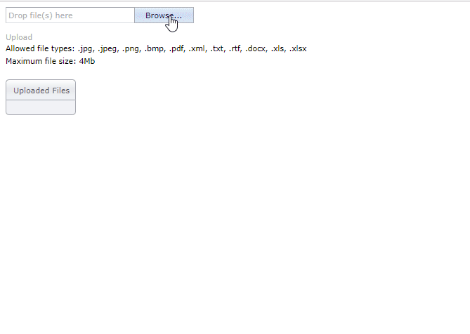

<!-- default badges list -->
[](https://supportcenter.devexpress.com/ticket/details/T227032)
[](https://docs.devexpress.com/GeneralInformation/403183)
<!-- default badges end -->
# Upload Control for ASP.NET MVC - How to upload multiple files at once

This example demonstrates how to enable drag-and-drop support in the [Upload Control](https://docs.devexpress.com/AspNetMvc/8977/components/file-management/file-upload) extension and allow users to upload multiple files at once. After a user uploads files on the server, links to the uploaded files appear in the [Round Pannel](https://docs.devexpress.com/AspNetMvc/8976/components/multi-use-site-extensions/roundpanel?p=netframework) below the Upload Control.



## Overview:

Follow the steps below to allow users to upload multiple files and display links to uploaded files on a web page:

1. Add the [Upload Control extension](https://docs.devexpress.com/AspNetMvc/DevExpress.Web.Mvc.UploadControlExtension?p=netframework) to a view. To do this, you can use the [Insert Extension Wizard](https://docs.devexpress.com/AspNetMvc/14551/whats-installed/insert-devexpress-mvc-extension-wizard) or write the extension code manually.

2. In the *Global.asax* or *RouteConfig* file, add the **.ashx** file extension to route exceptions:

    ```cs
    routes.IgnoreRoute("{resource}.axd/{*pathInfo}");
    routes.IgnoreRoute("{resource}.ashx/{*pathInfo}");
    ```

3. Place the [Round Panel extension](https://docs.devexpress.com/AspNetMvc/DevExpress.Web.Mvc.RoundPanelExtension?p=netframework) below the Upload Control:

    ```razor
    @Html.DevExpress().RoundPanel(settings => {
        settings.Name = "RoundPanel";
        settings.HeaderText = "Uploaded Files";
        settings.SetContent(() => { ViewContext.Writer.Write("<div id='fileContainer'/>"); });
    }).GetHtml()
    ```

4. Configure settings of the Upload Control extension. Set the extension's [UploadMode](https://docs.devexpress.com/AspNetMvc/DevExpress.Web.Mvc.UploadControlSettings.UploadMode?p=netframework) property to [Advanced](https://docs.devexpress.com/AspNet/DevExpress.Web.UploadControlUploadMode) to enable advanced upload mode. To allow users to upload multiple files, set the [EnableMultiSelect](https://docs.devexpress.com/AspNet/DevExpress.Web.UploadAdvancedModeSettings.EnableMultiSelect?p=netframework) property to `true`. The [EnableDragAndDrop](https://docs.devexpress.com/AspNet/DevExpress.Web.UploadAdvancedModeSettings.EnableDragAndDrop) property specifies whether to enable drag-and-drop support.

    ```razor
    @Html.DevExpress().UploadControl(settings => {
        settings.Name = "UploadControl";
        settings.ShowUploadButton = true;
        settings.ShowProgressPanel = true;
        settings.UploadMode = DevExpress.Web.UploadControlUploadMode.Advanced;
        settings.AdvancedModeSettings.EnableMultiSelect = true;
        settings.AdvancedModeSettings.EnableFileList = true;
        settings.AdvancedModeSettings.EnableDragAndDrop = true;
        settings.ClientSideEvents.FilesUploadComplete = "OnFilesUploadComplete";
    }).GetHtml()
    ```

5. Call the [Html.BeginForm](https://learn.microsoft.com/en-us/dotnet/api/system.web.mvc.html.formextensions.beginform?view=aspnet-mvc-5.2#system-web-mvc-html-formextensions-beginform(system-web-mvc-htmlhelper-system-string-system-string)) method overload to wrap the Upload Control in the `<form>` HTML tag. To set the tag's action attribute, pass a name of an action method to the `BeginForm` method:

    ```razor
    @using (Html.BeginForm("UploadControlUpload", "Home")) {
        @Html.DevExpress().UploadControl(settings => {
            // ...
        }).GetHtml()
    }
    ```

6. In the action method, call the Upload Control's [GetUploadedFiles](https://docs.devexpress.com/AspNetMvc/DevExpress.Web.Mvc.UploadControlExtension.-l------------y-) method overload to get the uploaded files and handle the server-side [FilesUploadComplete](https://docs.devexpress.com/AspNet/DevExpress.Web.ASPxUploadControl.FilesUploadComplete) event:

    ```cs
    public ActionResult UploadControlUpload() {
        string[] errors;
        UploadedFile[] files = UploadControlExtension.GetUploadedFiles("UploadControl",
            MyUploadControlValidationSettings.Settings, out errors, (s, e) => { },
            UploadControl_FilesUploadComplete);
        return null;
    }
    ```
7. In the `FilesUploadComplete` event handler, save the uploaded files on the server. Write names of uploaded files and their URLs in a string. Assign this string to the [CallbackData](https://docs.devexpress.com/AspNet/DevExpress.Web.FilesUploadCompleteEventArgs.CallbackData) event argument to pass the string to the client:

    ```cs
    public void UploadControl_FilesUploadComplete(object sender, FilesUploadCompleteEventArgs e) {
        UploadedFile[] files = ((MVCxUploadControl)sender).UploadedFiles;
        for (int i = 0; i < files.Length; i++) {
            if (files[i].IsValid && !string.IsNullOrWhiteSpace(files[i].FileName)) {
                string resultFilePath = "~/Content/" + files[i].FileName;
                files[i].SaveAs(System.Web.HttpContext.Current.Request.MapPath(resultFilePath)); 
                string file = string.Format("{0} ({1}KB)", files[i].FileName, files[i].ContentLength / 1024);
                string url = ((IUrlResolutionService)sender).ResolveClientUrl(resultFilePath);
                e.CallbackData += file + "|" + url + "|";
            }
        }
    }
    ```
8. Handle the Upload Control's client-side [FilesUploadComplete](https://docs.devexpress.com/AspNet/DevExpress.Web.ASPxUploadControl.FilesUploadComplete) event. The [callbackData](https://docs.devexpress.com/AspNet/js-ASPxClientUploadControlFilesUploadCompleteEventArgs.callbackData) event argument contains the string passed from the server. Get file names and URLs from the string and use them to display links to the uploaded files in the Round Panel:

    ```js
    function OnFilesUploadComplete(s, e) {
        var data = e.callbackData.split('|');
        for (var i = 0; i < data.length; i += 2) {
            var file = data[i];
            var url = data[i + 1];
            var link = document.createElement('A');
            link.innerHTML = file;
            link.setAttribute('href', url);
            link.setAttribute('target', '_blank');
            var fileContainer = document.getElementById('fileContainer');
            fileContainer.appendChild(link);
            fileContainer.appendChild(document.createElement('BR'));
        }
    }
    ```

## Files to Review

* [HomeController.cs](./CS/UploadControlExample/Controllers/HomeController.cs) (VB: [HomeController.vb](./VB/UploadControlExample/Controllers/HomeController.vb))
* [UploadControlValidationSettings.cs](./CS/UploadControlExample/Models/UploadControlValidationSettings.cs) (VB: [UploadControlValidationSettings.vb](./VB/UploadControlExample/Models/UploadControlValidationSettings.vb))
* [Index.cshtml](./CS/UploadControlExample/Views/Home/Index.cshtml) (VB: [Index.vbhtml](./VB/UploadControlExample/Views/Home/Index.vbhtml))

## Documentation

* [Upload Modes](https://docs.devexpress.com/AspNet/9886/components/file-management/file-upload/concepts/upload-modes)

## More Examples

* [Upload Control for ASP.NET MVC - How to bind uploaded files to a model](https://github.com/DevExpress-Examples/uploadcontrol-with-model-binding-support-registration-form-t185980)
* [Upload Control for ASP.NET MVC - How to upload a file](https://www.devexpress.com/Support/Center/p/E4381)
