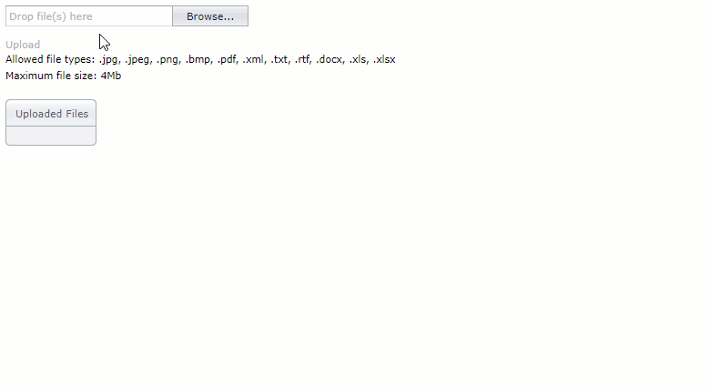

<!-- default file list -->
*Files to look at*:

* [HomeController.cs](./CS/UploadControlExample/Controllers/HomeController.cs) (VB: [HomeController.vb](./VB/UploadControlExample/Controllers/HomeController.vb))
* [UploadControlValidationSettings.cs](./CS/UploadControlExample/Models/UploadControlValidationSettings.cs) (VB: [UploadControlValidationSettings.vb](./VB/UploadControlExample/Models/UploadControlValidationSettings.vb))
* [Index.cshtml](./CS/UploadControlExample/Views/Home/Index.cshtml) (VB: [Index.vbhtml](./VB/UploadControlExample/Views/Home/Index.vbhtml))
<!-- default file list end -->
# UploadControl - An example of use

### The MVC [UploadControl](https://documentation.devexpress.com/AspNet/9002/ASP-NET-MVC-Extensions/File-Management/File-Upload/Overview/Overview-UploadControl) configuration here allows you to upload multiple files at once. It also supports drag and drop and upload progress indication. Links to the uploaded files will be displayed in a special container.

## Steps to implement:
1. Add the UploadControl extension to View. The easiest way is to use the [*Insert Extension Wizard*](https://documentation.devexpress.com/AspNet/14551/What-s-Installed/Visual-Studio-Integration/Insert-MVC-Extension-Wizard/Insert-DevExpress-MVC-Extension-Wizard), but you can write code manually as well.
2. Wrap the control in the "form" HTML tag. In this example, the [*Html.BeginForm*](https://docs.microsoft.com/en-us/dotnet/api/system.web.mvc.html.formextensions.beginform?view=aspnet-mvc-5.2) method is used to create a form.
3. Specify the Action method that handles file uploading. E.g.:
```cs
@using (Html.BeginForm("UploadControlUpload", "Home")){
    @Html.DevExpress().UploadControl(settings => {
        settings.Name = "UploadControl";
        settings.ShowProgressPanel = true;
        settings.AdvancedModeSettings.EnableMultiSelect = true;
        settings.AdvancedModeSettings.EnableFileList = true;
        settings.AdvancedModeSettings.EnableDragAndDrop = true;
    }).GetHtml()}
```
4. Get the uploaded files in the Action method with the static [*UploadControlExtension.GetUploadedFiles*](https://documentation.devexpress.com/AspNet/DevExpress.Web.Mvc.UploadControlExtension.GetUploadedFiles.overloads) method.
```cs
UploadedFile[] files = UploadControlExtension.GetUploadedFiles("UploadControl",
                MyUploadControlValidationSettings.Settings, out errors, (s, e) => { },
                UploadControl_FilesUploadComplete);
```
5. (*OPTIONAL*) To pass information about uploaded files to the client side, add the *FilesUploadComplete* handler and assign required info to e.CallbackData:
```cs
public void UploadControl_FilesUploadComplete(object sender, FilesUploadCompleteEventArgs e) {
            UploadedFile[] files = ((MVCxUploadControl)sender).UploadedFiles;
            // files processing...
            e.CallbackData = "Info";
}

```
6. (*OPTIONAL*) Get the information passed from your Controller to the client, in the client-side [*ASPxClientUploadControl.FilesUploadComplete*](https://documentation.devexpress.com/AspNet/DevExpress.Web.Scripts.ASPxClientUploadControl.FilesUploadComplete.event) event handler:
```cs
 @Html.DevExpress().UploadControl(settings => {
    settings.Name = "UploadControl";
    ...
    settings.ClientSideEvents.FilesUploadComplete = "OnFilesUploadComplete";}).GetHtml()
```
```js
  function OnFilesUploadComplete(s, e) {
        var data = e.callbackData; // info from your Controller
        ...      
    }
```
### Result:



**See Also:**

<a href="https://www.devexpress.com/Support/Center/p/T185980">T185980 - UploadControl with Model Binding Support - Registration Form</a> <br /><a href="https://www.devexpress.com/Support/Center/p/E4381">E4381 - UploadControl - How to upload a file via AJAX</a> 